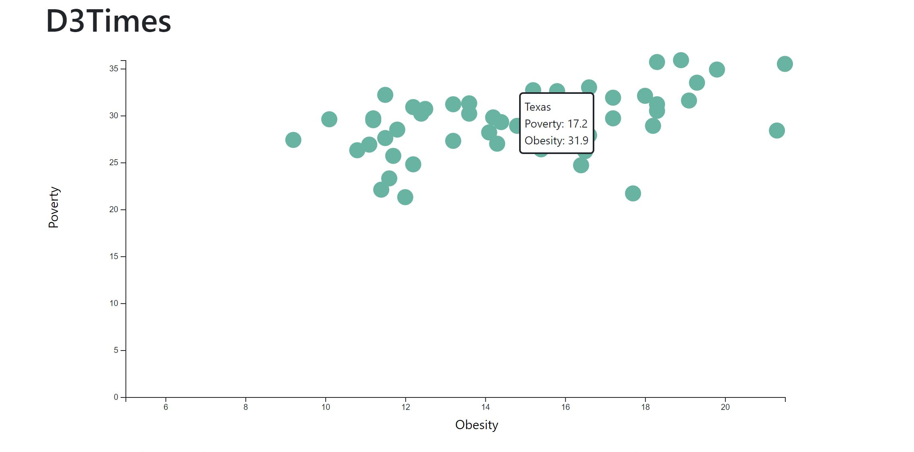

# D3-challenge - Core assignment
I have created a scatter plot between poverty and obesity and included tooltips that contain information on relevant state and both data variables. 

I have used python -m http.server to run the visualisation. This will host the page at localhost:8000 in the web browser.

